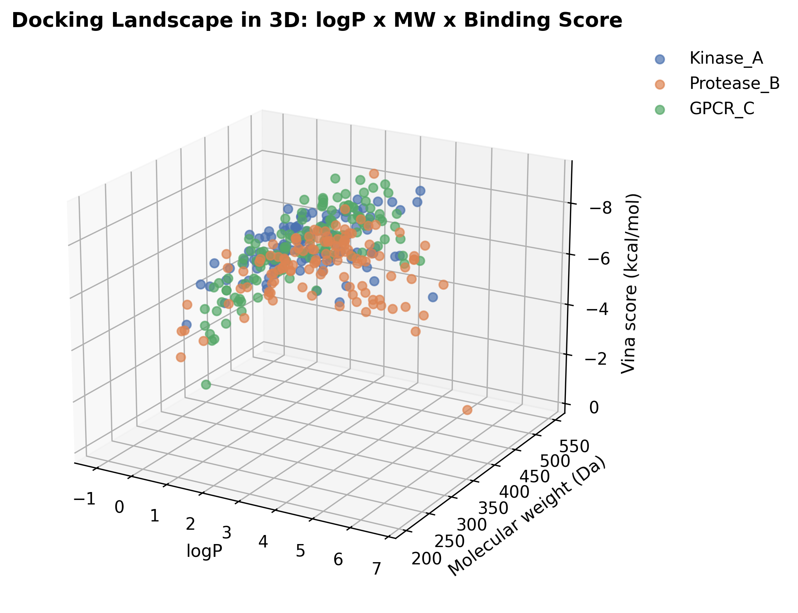
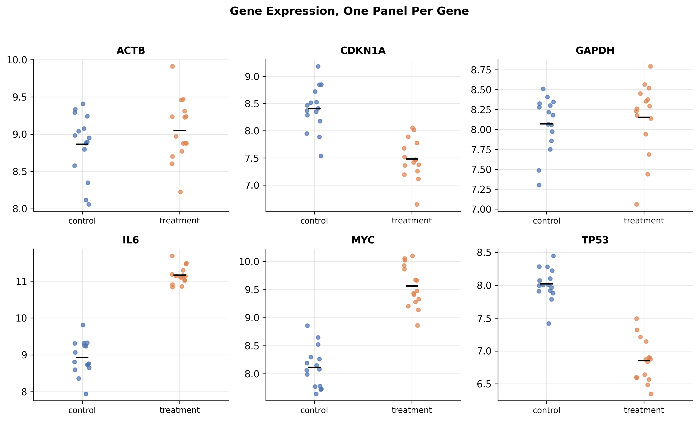
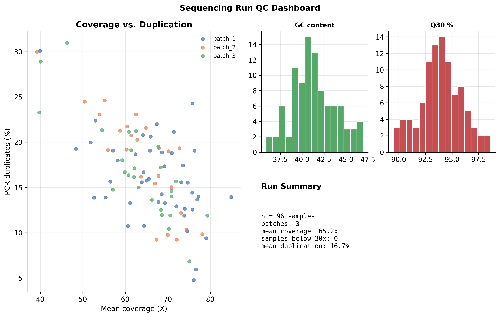
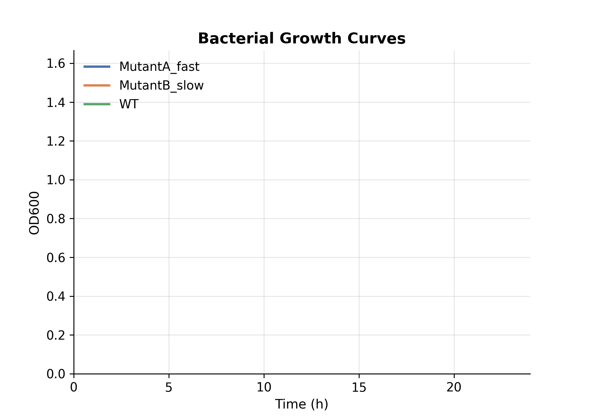
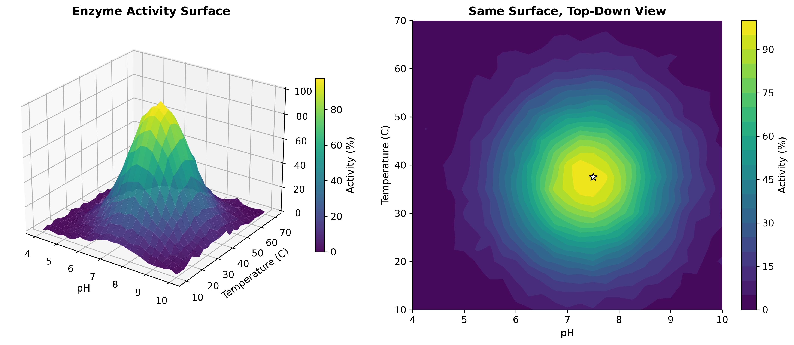
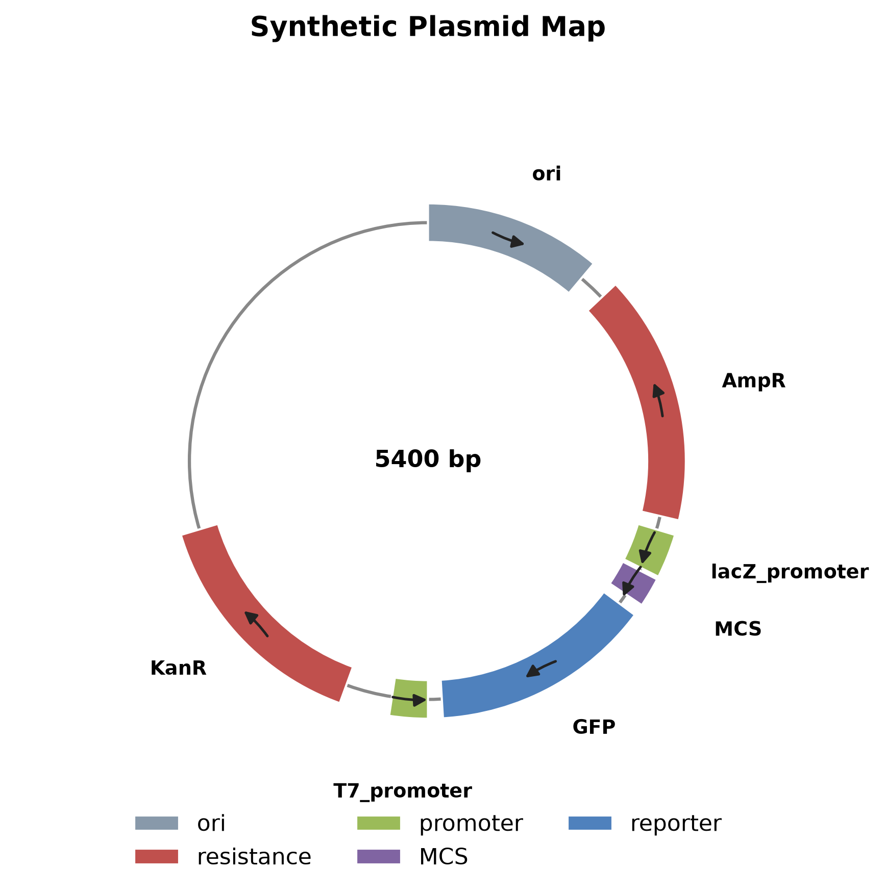
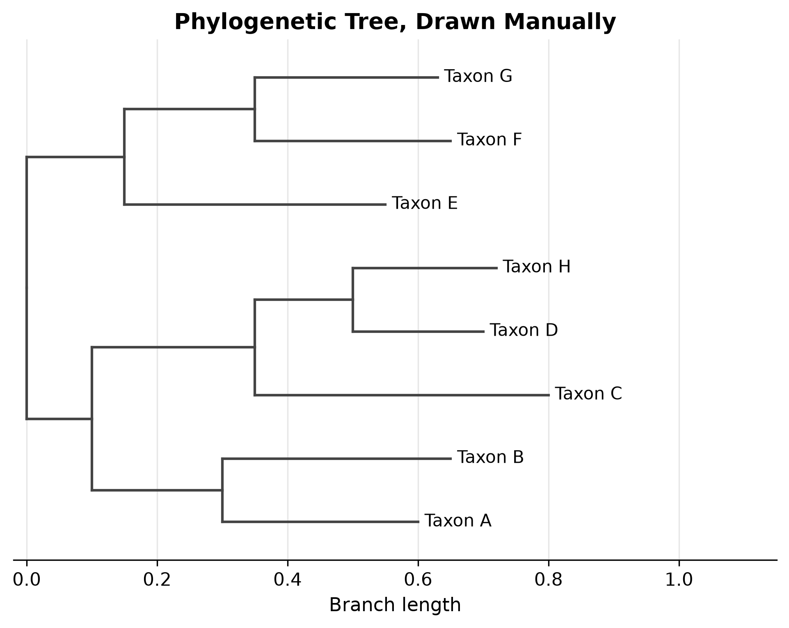
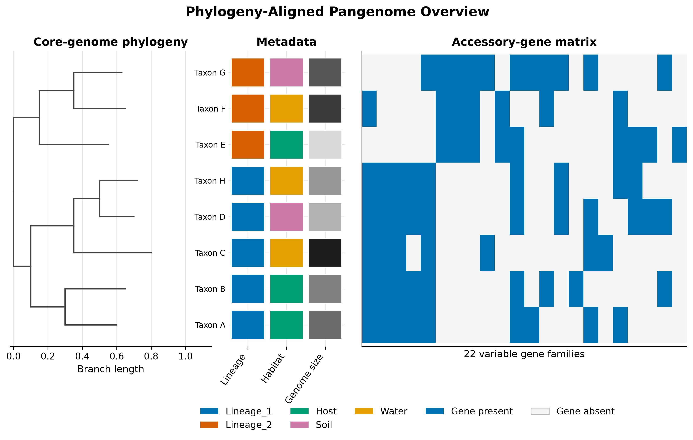
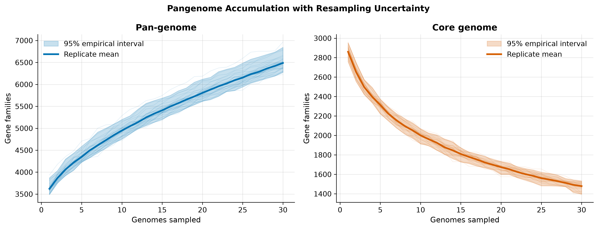
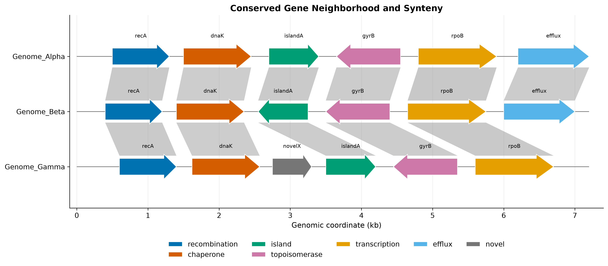

# Scientific Figure Engineering with Matplotlib

[](https://github.com/mbilal-OU/biology-data-viz-matplotlib/actions/workflows/ci.yml)
[](https://github.com/mbilal-OU/biology-data-viz-matplotlib/actions/workflows/docs.yml)
[](pyproject.toml)
[](LICENSE)

A tested portfolio of custom scientific figures for biology, genomics, and
bioinformatics. It focuses on the work below a high-level plotting call:
coordinate systems, topology-aware layouts, patches, shared axes, GridSpec,
animation, vector export, validation, and reproducible figure construction.

All included datasets are seeded simulations with documented structure. They
exist to test figure behavior and do not represent experimental evidence.

## Start here: the visualization learning path

This is a **public, tutorial-first portfolio repository**. The README is designed
to let a learner scan the figures first, understand the analytical question,
open the matching notebook, and then reuse the tested plotting functions.

| Goal | Best starting point |
|---|---|
| Learn the visual grammar from worked examples | Browse the visual tutorial gallery below |
| Reproduce every figure | Run the notebooks from top to bottom |
| Reuse tested plotting code | Import the functions in the reusable API section |
| Understand scientific limitations | Read the scientific guardrails before interpreting a plot |
| Build a publication figure | Export PNG for review and SVG/PDF for final editing |

### A growing visualization series

The two current repositories establish a reusable pattern for a broader public
learning series:

- **Seaborn**: statistical graphics, tidy data, semantic mappings, distributions,
  uncertainty, and omics exploration.
- **Matplotlib**: low-level figure engineering, custom geometry, dashboards,
  animation, phylogenomics, genome tracks, and publication layout.
- **Future Python and R modules** can follow the same structure for interactive
  graphics and specialist ecosystems such as Plotly, Altair, ggplot2, ggtree,
  ComplexHeatmap, and Shiny.

Each module should remain independently runnable, visual from the first screen,
scientifically careful, and strong enough to serve as both a tutorial and a
portfolio artifact.

## Visual tutorial gallery

Every figure below is generated by repository code. Click a figure to open the
full-resolution output. The foundational examples are developed in
[the Matplotlib guide](notebooks/matplotlib_beginner_guide.ipynb), and the
genomics layouts are developed in
[the advanced case studies](notebooks/advanced_case_studies.ipynb).

### Low-level geometry and multi-panel control

| Tutorial example | Tutorial example |
|---|---|
| **3D docking landscape**<br>[](figures/01_docking_3d.png)<br>Three-dimensional projection, color mapping, depth cues, and controlled camera geometry. | **Gene-expression panels**<br>[](figures/02_gene_expression_panels.png)<br>Shared axes, panel labeling, comparison-friendly scales, and publication spacing. |
| **Sequencing-QC dashboard**<br>[](figures/03_qc_dashboard.png)<br>A compact dashboard combining multiple plot types, annotations, and actionable thresholds. | **Animated growth curves**<br>[](figures/04_growth_curves.gif)<br>Frame-based animation that reveals temporal dynamics while preserving stable axes and context. |

### Scientific coordinate systems and custom objects

| Tutorial example | Tutorial example |
|---|---|
| **Enzyme-response surface**<br>[](figures/05_enzyme_surface.png)<br>Surface geometry, scientific color mapping, and three-variable response interpretation. | **Circular plasmid map**<br>[](figures/06_plasmid_map.png)<br>Polar coordinates, genomic features, strand direction, labels, and custom patches. |
| **Phylogenetic tree**<br>[](figures/07_phylo_tree.png)<br>Manual tree layout, branch geometry, tip labels, clade highlighting, and metadata-aware styling. |  |

### Genomics figure engineering

| Tutorial example | Tutorial example |
|---|---|
| **Phylogeny-aligned pangenome panel**<br>[](figures/08_phylogenomics_panel.png)<br>Synchronized axes align a tree, sample metadata, and gene presence–absence matrix. | **Pangenome accumulation**<br>[](figures/09_pangenome_accumulation.png)<br>Permutation-based pan/core trajectories with uncertainty bands and transparent summary statistics. |
| **Synteny and gene neighborhoods**<br>[](figures/10_synteny_tracks.png)<br>Directional gene glyphs, coordinate transforms, homology links, and multi-genome comparison. |  |

## Demonstrated capabilities

| Figure-engineering task | Implementation | Biological example |
|---|---|---|
| Align heterogeneous panels | Shared topology-derived y coordinates and GridSpec | Phylogeny, metadata, pangenome |
| Display sampling uncertainty | Replicate layers, mean curve, empirical interval | Pan/core accumulation |
| Draw directional features | `FancyArrow`, `Polygon`, explicit coordinates | Gene neighborhoods and synteny |
| Construct circular diagrams | Wedges, tangent arrows, functional legend | Plasmid map |
| Build dashboards | Nested GridSpec and summary text | Sequencing QC |
| Compare many groups | Small multiples with controlled axes | Gene expression |
| Show a response surface | 3D surface paired with a 2D contour | Enzyme activity |
| Animate temporal data | `FuncAnimation` with deterministic frames | Bacterial growth |
| Inspect three continuous axes | 3D scatter plus documented 2D tradeoff | Docking landscape |

The repository also covers annotation, z-order, clipping, legends, colorbars,
accessible colors, raster and vector export, reusable APIs, and semantic tests.

## Quick start

```bash
git clone https://github.com/mbilal-OU/biology-data-viz-matplotlib.git
cd biology-data-viz-matplotlib
python -m venv .venv
source .venv/bin/activate
python -m pip install -r requirements.txt
python -m pip install -e .
jupyter lab
```

Windows instructions are available in [`docs/setup.md`](docs/setup.md). Start
with
[`notebooks/scientific_figure_case_studies.ipynb`](notebooks/scientific_figure_case_studies.ipynb).
The original technique-by-technique notebook remains available at
[`notebooks/matplotlib_beginner_guide.ipynb`](notebooks/matplotlib_beginner_guide.ipynb).

## Reusable API

```python
import pandas as pd
from bioplt import phylogenomics, theme

theme.set_theme()

edges = pd.read_csv("data/phylo_edges.csv")
metadata = pd.read_csv("data/phylo_metadata.csv")
genes = pd.read_csv("data/phylo_gene_presence.csv")

fig, axes = phylogenomics.phylogenomics_panel(edges, metadata, genes)
theme.savefig(fig, "phylogenomics.svg")
```

Synteny is built from explicit gene and link tables:

```python
from bioplt import genome_tracks

features = pd.read_csv("data/synteny_genes.csv")
links = pd.read_csv("data/synteny_links.csv")
fig, ax = genome_tracks.synteny_plot(features, links)
```

## Scientific and visual guardrails

- A phylogenetic root is inferred only when exactly one parentless node exists.
- Branch length controls horizontal distance; rectangular placement does not
  imply time unless the input tree is time calibrated.
- Tip order follows topology, not alphabetical sorting.
- Accumulation bands describe resampling sensitivity, not model-based confidence
  unless a model is explicitly fitted.
- 3D graphics are paired with or compared against 2D views because perspective
  and occlusion can reduce quantitative readability.
- Homology links encode supplied relationships; the plotting function does not
  infer orthology or synteny.

## Reproducibility and quality checks


```bash
python scripts/generate_datasets.py
python scripts/build_advanced_gallery.py
pytest -q
ruff check bioplt scripts tests
mkdocs build --strict
```

Continuous integration checks deterministic data generation, semantic and
rendering tests, at least 95% package coverage, notebook execution, strict
documentation links, linting, and package construction. The theme supports
300-DPI PNG and TIFF plus vector SVG and PDF output with editable text.

## Repository map

```text
bioplt/       reusable low-level scientific figure components
data/         deterministic figure inputs and data dictionary
figures/      rendered raster, vector, and animated gallery
notebooks/    narrative core and advanced case studies
scripts/      deterministic data and gallery builders
tests/        rendering, geometry, schema, and biological sanity checks
docs/         documentation site source
```

## Scope

This repository demonstrates custom static and animated scientific figures.
Statistical visualization, Seaborn semantics, differential-expression displays,
ordination, and compositional-data examples are covered in the companion
[biology-data-viz-seaborn](https://github.com/mbilal-OU/biology-data-viz-seaborn)
repository.

## Citation and license

Citation metadata are provided in [`CITATION.cff`](CITATION.cff). The code is
released under the [MIT License](LICENSE).
