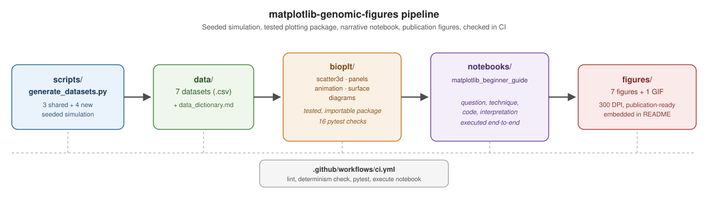

# Documentation

**Start here** if you're new to the repo: [`../README.md`](../README.md)
gives the overview, quick start, and repository map.

## Contents

| Doc | What's in it |
|---|---|
| [`gallery.md`](gallery.md) | Every figure in the repo, paired with the exact code that produced it |
| [`../data/data_dictionary.md`](../data/data_dictionary.md) | Column-by-column definitions and the simulation rationale behind each dataset |
| [`../CONTRIBUTING.md`](../CONTRIBUTING.md) | How to add a new technique, dataset, or fix |
| [`../CITATION.cff`](../CITATION.cff) | Citation metadata |

## How the pieces fit together

1. **`scripts/generate_datasets.py`**: seeded (`np.random.default_rng(42)`)
   simulation of all 7 datasets. Three reuse the same generation logic
   as the companion biology-data-viz-seaborn repository; four are new,
   chosen to need a Matplotlib-only technique.
2. **`data/*.csv`**: the generated datasets, plus
   [`data_dictionary.md`](../data/data_dictionary.md) describing every column.
3. **`bioplt/`**: a small, tested, importable plotting package. One
   module per technique (`scatter3d`, `panels`, `animation`,
   `surface`, `diagrams`), each function documented and covered by
   `tests/test_bioplt.py`.
4. **`notebooks/`**: the tutorial notebook walks through all 7
   techniques with biological question, rationale, code, and
   interpretation for each.
5. **`figures/`**: 300 DPI exported PNGs plus one animated GIF,
   embedded in [`gallery.md`](gallery.md) and the README.
6. **CI** (`.github/workflows/ci.yml`): on every push, lint with ruff,
   regenerate the datasets and diff against what's committed (catches
   silent nondeterminism), run the pytest suite, and re-execute the
   notebook end-to-end.

## Design principles

- **Every dataset has a reason.** Nothing is `np.random.rand()` with no
  structure. Each CSV is built to have a specific, documented,
  interpretable signal (see the rationale docstrings in
  `generate_datasets.py`).
- **Every technique here genuinely needs Matplotlib.** This repo does
  not duplicate what Seaborn already does well. Each of the 7 sections
  exists because Seaborn has no direct equivalent (3D plots,
  animation, custom GridSpec layouts, hand-drawn diagrams).
- **Tests check structure and biology, not just rendering.** Beyond
  "does the plot render," `tests/test_bioplt.py` checks that
  quantitative and structural results match the simulation's ground
  truth, for example that the enzyme activity surface's peak lands
  near the simulated pH and temperature optimum.
- **The notebook is a source of truth, not a demo.** It's executed in
  CI on every push, so committed output always matches the code that
  produced it.
